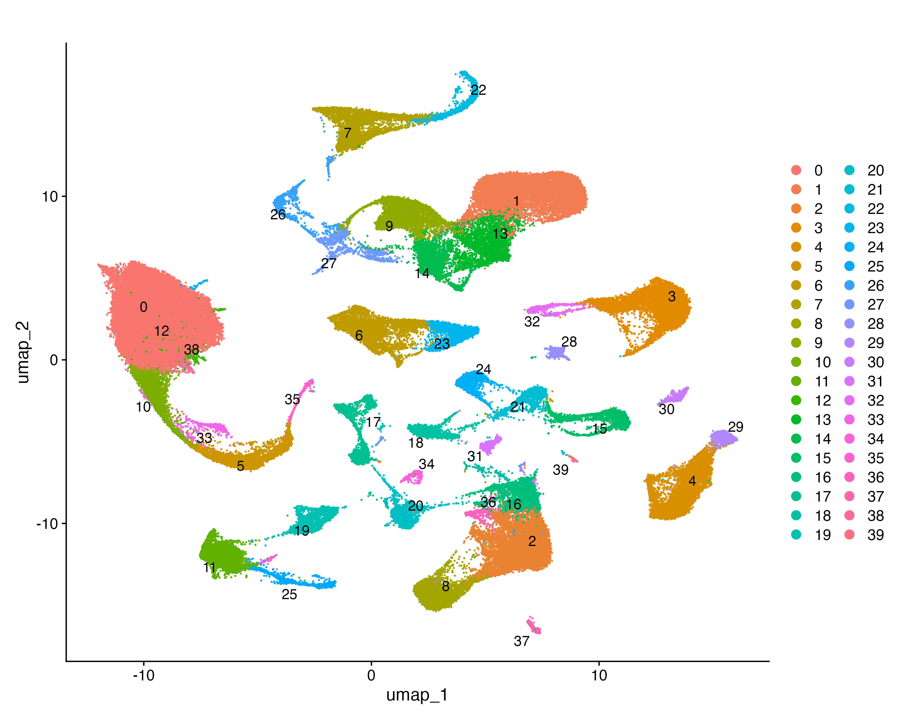
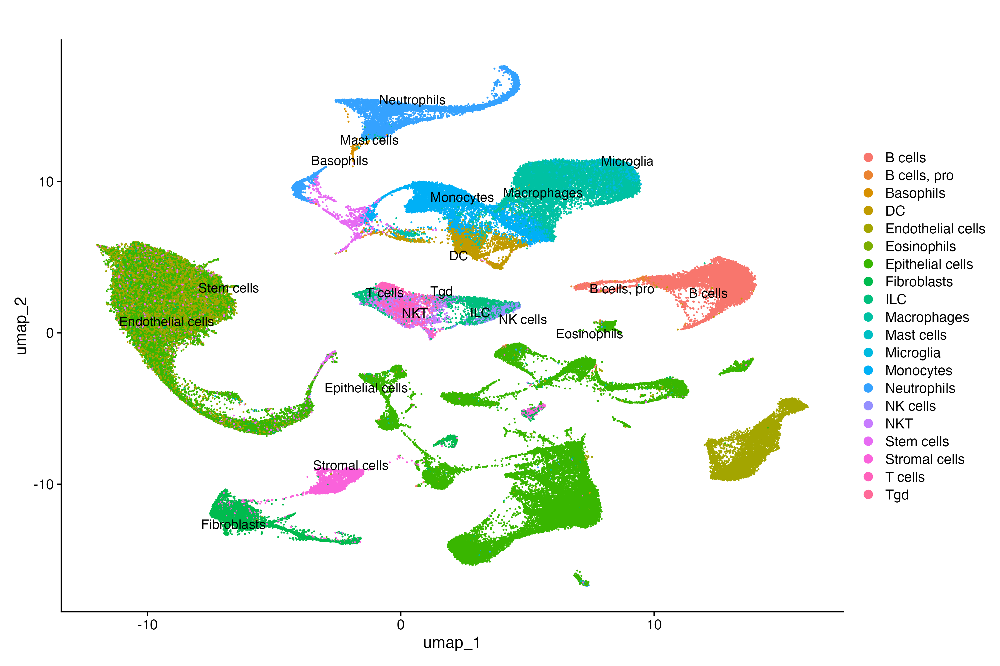
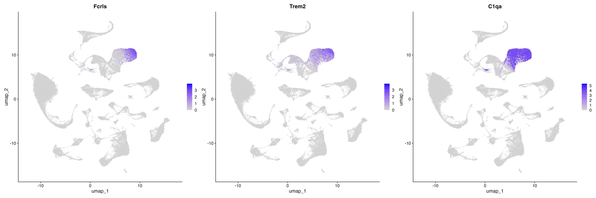
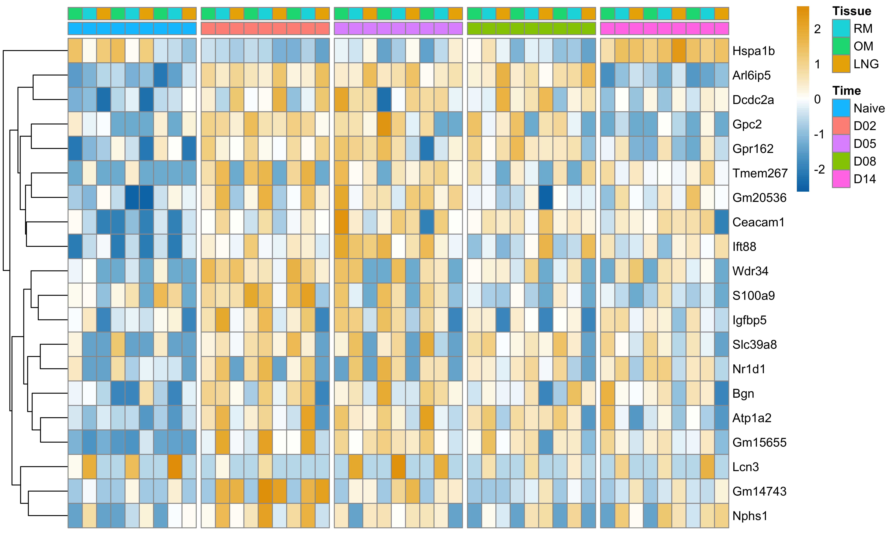
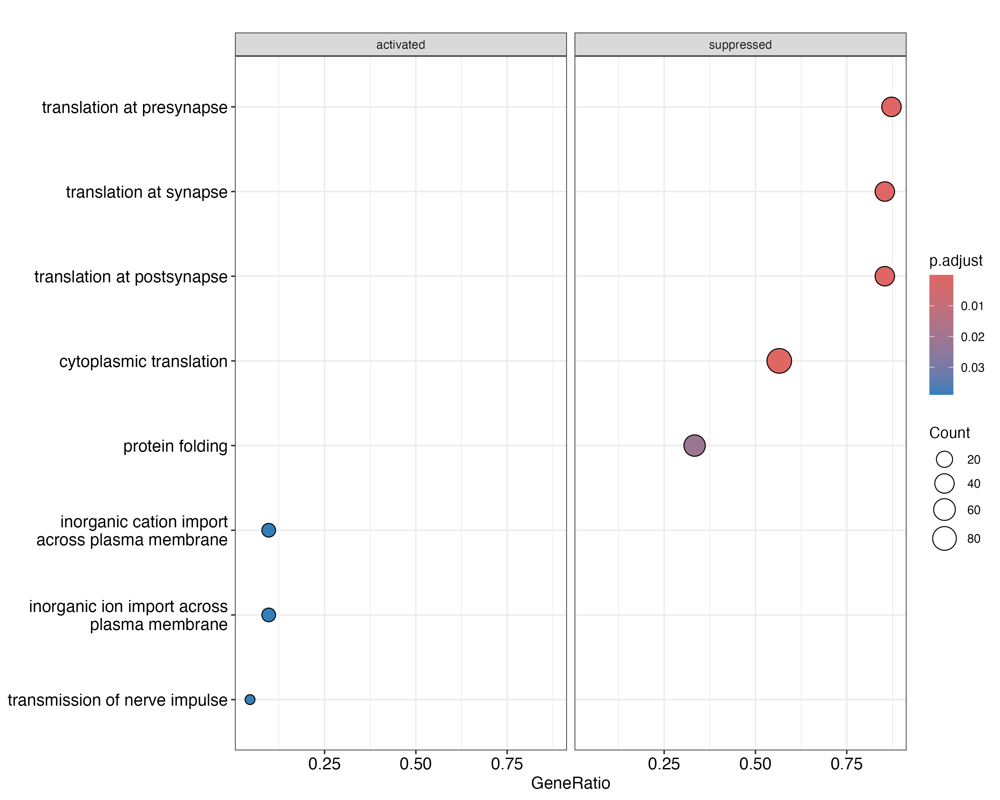
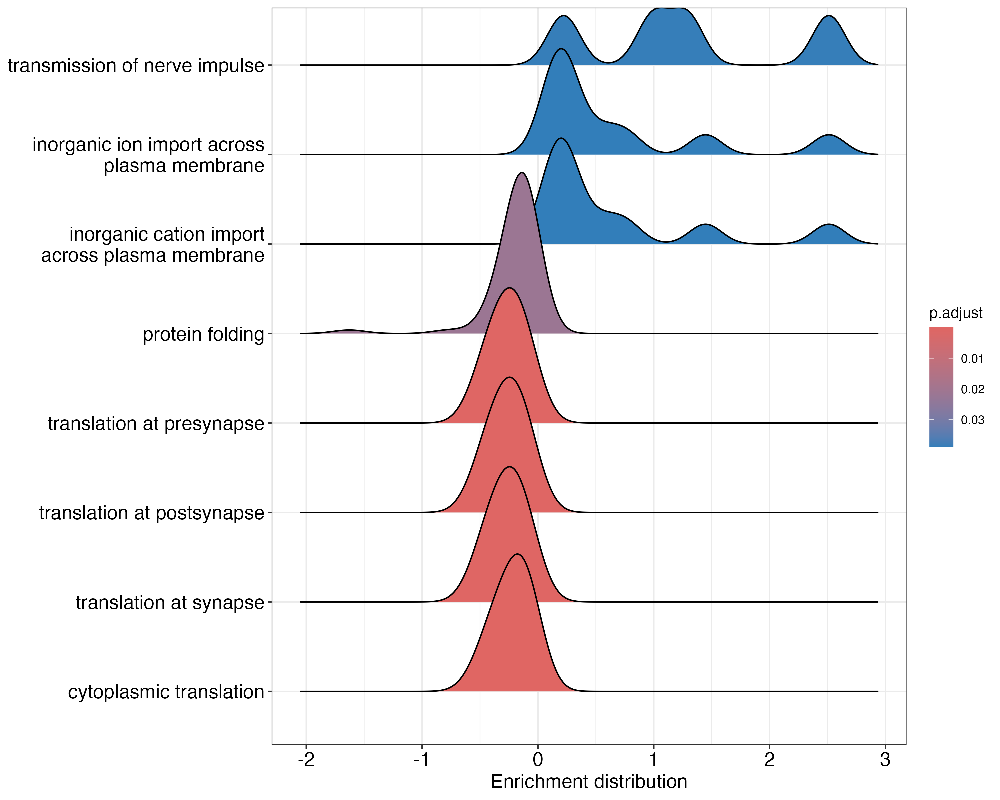

# scRNA-seq clustering, differential expression, and functional analysis of mouse nasal mucosa macrophages during influenza A virus infection

## Introduction

Studying cell response to pathogens such as influenza A virus (IAV) is vital for the development of preventative and treatment measures. Single-cell RNA sequencing (scRNA-seq) has enabled advancements in our understanding of host responses to pathogens by revealing cell-specific immune responses, which helps inform the diagnosis, treatment and prevention of infection (1). Specifically, identifying expression differences between cells throughout stages and severity of an infection leads to targeted therapies based on marker genes associated with certain cell types (2). As the nasal mucosa is a primary defence against invasion of the respiratory tract by IAV, it serves as an ideal location to employ scRNA-seq to study cell responses to such pathogens (3). In particular, macrophages are critical immune cells that respond to pathogens through phagocytosis, cytokine secretion, and coordination of diverse downstream immune responses (4). Further characterization of macrophage function, including identification of differentially expressed genes throughout infection, remains an active area of research. Here, a workflow was designed to use scRNA-seq data from the nasal mucosa of mice to pinpoint differences in macrophage response to infection between uninfected cells and cells at peak viral load (2 days post-infection).

While scRNA-seq is a powerful tool for identifying differential expression between cells, its analysis requires carefully designed protocols to ensure analytical rigor. First, preprocessing steps must consider the technical noise and sparsity inherent to scRNA-seq data. For example, filtering for mitochondrial fraction helps reduce the probability of degraded cells compromising the analysis. Additionally, normalization is required to account for differences in sequencing depth across cells, reducing systematic bias (5). Dimensionality reduction is another important step prior to cluster analysis, as it enables complex analyses of clusters and subclusters while avoiding noise. Principal components analysis (PCA) is a common dimension reduction technique used with scRNA-seq data as it retains structure while capturing variance (5). Furthermore, clustering algorithms and tools are central to scRNA-seq analysis, as this step recovers biologically meaningful cell groups for further downstream analysis. Graph-based methods like Leiden and Louvain are usually preferred due to their ability to characterize complex community structure; k-means clustering is an option but is not typically appropriate as it does not perform well on datasets with over 100, 000 cells, and requires prior knowledge of clusters (5). Finally, differential expression analysis of scRNA-seq calls for specific statistical treatment due to zero inflation. One way to address this is through pseudobulking, which aggregates cells within a biological replicate. Cells within each biological replicate can follow similar statistical methods to bulk RNA-seq data, which produces fewer false positives than statistical methods developed to handle individual cells (6). 

For the current analysis, the Seurat package was selected as the analytical tool used for filtering, normalizing, and clustering the data (7). While several tools exist for scRNA-seq analysis, Seurat (ARI = 0.79) was identified as the most successful at recovering immune cell subtypes when compared against other clustering frameworks such as Monocle3 (ARI = 0.62) at 11 clusters (8). Additionally, Seurat has been found to run faster than other comparable methods such as SC3 (9).
After pseudobulking, DESeq2 was the preferred tool for differential expression analysis (10). Compared to other analytical tools, DESeq2 is among the most conservative, meaning that fewer false positives are reported (11). As well, DESeq2 has built-in normalization and additional functions that allow for flexibility with data input that make it a convenient option.

This analysis aims to demonstrate a robust scRNA-seq workflow applied to mouse nasal mucosa tissue across multiple timepoints of IAV infection, and to characterize the transcriptional response of macrophages between uninfected controls and peak viral load. The data were obtained from Kazer and colleagues’ study of tissues in the nasal mucosa of mice after infection with IAV (12). The Seurat framework was primarily employed for this workflow, with quality assessment and filtering conducted with the `PercentageFeatureSet` and `subset` functions. Data were normalized using `NormalizeData` with log normalization, followed by identification of the most highly variable genes using `FindVariableFeatures`. Prior to dimensionality reduction, gene expression was scaled across cells using `ScaleData`, applied only to variable features to reduce computational overhead. `RunPCA` was applied for dimensionality reduction. The `FindNeighbors` and `FindClusters` functions were used for clustering based on the appropriately selected resolution and number of PCs. `FindAllMarkers` identified differentially expressed genes for each of the identified clusters. To confirm cluster identity, SingleR and celldex (13) were used for cluster annotation, using the `ImmGenData` reference library  The `ImmGenData` reference was selected over the `MouseRNASeqData` reference for a more detailed annotation for immune-specific cell types and subtypes. `RunUMAP` was done before and after annotation, to assess the recovered clusters. Pseudobulking was performed with `AggregateExpression` from Seurat, and DESeq2 was used for differential expression analysis with `lfcShrink` and `apeglm` to calculate log2 fold changes (10, 14). Finally, to assess Gene Ontology Biological Processes (GO BP) enrichment, clusterProfiler (15) and Bioconductor’s `org.Mm.eg.db` (16) were utilized.

## Methods
### Computational Resources 
All analyses were conducted on a local Apple MacBook Pro (M4 architecture). The workflow for the analysis is pictured in Figure 1.

**Figure 1. Workflow used for scRNA-seq analysis.** All steps including data cleaning, normalization and scaling, dimensionality reduction, clustering, annotation, differential analysis, gene set enrichment analysis, and figure creation are depicted.

### Data Acquisition
The scRNA-seq data were acquired from Kazer and colleagues’ study (12), where the experimental design consisted of three mice per timepoint, sacrificed at five timepoints after introducing IAV: naive (uninfected), and 2, 5, 8, and 14 days post-infection (dpi). At each timepoint, three distinct regions of the nasal mucosa were dissected and sequenced: respiratory mucosa (RM), olfactory mucosa (OM), and lateral nasal gland (LNG). The data were obtained in the form of an RDS file containing a Seurat object with 156,572 cells prior to any filtering.

### Quality Control 
To identify and remove potentially degraded cells, empty droplets, and doublets, mitochondrial reads and unique RNA features were assessed with `PercentageFeatureSet` and subsequently filtered with`subset`, from Seurat v5.4.0 (7). Filtering was applied based on violin plot outputs, where cells were removed if they contained less than 200 `nFeature_RNA` and more than 10% `percent.mt`. No upper limit was applied to the nFeature_RNA as the distribution showed no prominent outlier population that would have suggested doublets (Figure 2). Approximately 56,000 missing mouse_id values were identified and retained for clustering analysis, but excluded from statistical analysis.

**Figure 2. Distribution of quality metrics before and after filtering.** Violin plots showing the distribution of (A, D) unique RNA features per cell, (B, E) total RNA counts per cell, and (C, F) mitochondrial read percentage across all five timepoints before (A–C) and after (D–F) filtering. Cells with fewer than 200 unique RNA features or greater than 10% mitochondrial reads were excluded, retaining 149,125 of 156,572 cells for downstream analysis.

### Normalization, Scaling and Dimensionality Reduction
Data normalization was performed with the `NormalizeData` function from Seurat, and variable features were identified with `FindVariableFeatures`. 3000 features were selected for further analysis as the variable feature plot identified variation in the dataset was captured by this subset (Figure 3). `ScaleData` was applied to the subset of variable features rather than all genes due to memory constraints with a dataset containing approximately 156 000 cells. Principal components analysis (PCA) was run with `RunPCA`, where the top 30 PCs were selected for downstream clustering analysis to balance the variation in the dataset without retaining too many dimensions. A visual assessment of an elbow plot determined that 30 PCs confirmed that most variation would be retained (Figure 4).

**Figure 3. Variable features capture biologically meaningful variation in the data across all cell types.** Variable feature plot showing the standardized variance against average expression for all 25,129 genes. Red dots indicate the 3000 variables selected by `FindVariableFeatures` with the top 20 features labelled.

**Figure 4. Variance captured by principal components shows gradual decrease.** Elbow plot showing the standard deviation associated with each of the top 50 principal components (PCs) from PCA. Thirty PCs were selected for downstream clustering to capture sufficient variance without retaining noise. 

### Clustering
Graph-based clustering was performed with `FindNeighbors` and `FindClusters`. The analysis was run with 30 PCs and 0.5 resolution to balance cluster specificity with interpretability, consistent with the resolution of 0.6 used in Kazer and colleagues work (12). `FindAllMarkers` was used to identify differentially expressed genes for each of the identified clusters.

### Annotation
Automatic annotation was performed with SingleR v2.10.0 (13) using the celldex v1.18.0 `ImmGenData` library containing mouse bulk expression data from the Immunologic Genome Project (13). `RunUMAP` from Seurat was done before and after annotation to visualize clusters and assess the biological structure of the data.

### Differential Expression Analysis and Visualization
Prior to differential analysis, the data were subset to cluster 1, which was identified as a predominantly macrophage population based on SingleR annotation and further validated through `FindAllMarkers`. To reduce false positives from arising as a result of the pseudoreplication that is characteristic of single-cell data, mean expression for each gene was aggregated across all cells within each mouse per timepoint and tissue type using pseudobulk analysis. Cells with missing mouse IDs were filtered out, then Seurat’s `AggregateExpression` function was used for pseudobulking, treating each mouse as an independent observation. Raw counts from the RNA assay layer of the Seurat object were extracted and used for DESeq2 v1.48.2 analysis of differentially expressed genes, including tissue types and timepoints in the statistical model (10). Finally, `lfcShrink` from DESeq2 was used to calculate log2 fold changes using the `apeglm` v1.30.0 shrinkage method (14). 

To visualize the top differentially expressed genes, a variance stabilizing transformation (VST) was performed prior to plotting results with pheatmap v1.0.13 (17). 

### Gene Set Enrichment Analysis
GSEA was conducted to identify enriched biological processes in macrophages at peak viral load (D02) relative to naive mice using the `gseGO` function from the clusterProfiler v4.16.0 package (15). Gene sets were taken from the GO BP ontology through the Bioconductor org.Mm.eg.db mouse v3.21.0 annotation database (16).

## Results

### Clustering with `FindClusters` recovers 40 clusters with some multi-cluster groups.
The clustering analysis revealed distinct structure in the data, producing 40 clusters (Figure 5). Many clusters form larger groups, such as clusters 26, 27, 9, 14, 13, and 1, while other clusters are independent, such as 37, 28, and 30 (Figure 5). 

**Figure 5. Clustering reveals 40 distinct structures amongst cells.** UMAP embedding of cells across 40 clusters.

### SingleR annotation labels cell types consistent with immune response
Following annotation with SingleR, 20 clusters were labelled across the 40 Seurat clusters recovered by the previous step (Figure 6). Several identified cell types are associated with immune response, including B cells, macrophages, monocytes, neutrophils, natural killer (NK) cells, and T cells. Epithelial and endothelial cells stand out as the most abundant cell types, followed by a group composed of microglia, macrophages, dendritic cells (DC), monocytes, and basophils (Figure 6).

**Figure 6. Annotation recovers cell types consistent with infected nasal mucosa**. UMAP embedding of cells with SingleR automatic annotations identifies specific cell types associated with immune response to pathogens.

### Cluster 1 contains macrophage associated marker genes
`FindAllMarkers` was used to identify marker genes associated with each cluster. Annotation identified cluster 1 as macrophages by SingleR, and subsequent marker analysis further corroborated the result by highlighting localization of classic macrophage markers (Figure 7). Fcrls, Trem2, and C1qa markers are all relatively highly expressed in cluster 1, with C1qa displaying the highest expression level in the cluster (Figure 7).

**Figure 7. Gene markers associated with macrophages appear in cluster 1.** Feature plots of macrophage-specific gene-markers Fcrls, Trem2, and C1qa all appear in the same cluster, previously identified as cluster 1. Purple values represent higher expression of the gene.

### Differential expression analysis exposes trends in infection-related genes between naive and peak viral load states.

The differential expression analysis highlighted variable trends in genes between tissue types and timepoints. In particular, Hspa1b, S100a9, and Nr1d1 display distinct patterns. Hspa1b was downregulated between naive and peak viral load states, with expression recovering by 14 dpi (Figure 8). Contrastingly, S100a9 was upregulated between naive and 2 dpi, returning to naive-levels of expression by 14 dpi. Finally, Nr1d1 exhibited tissue-specific expression patterns, with notably lower expression in LNG at peak viral load relative to naive, recovering to baseline levels by 5 dpi, before declining again at 8 dpi and partially recovering by 14 dpi.

**Figure 8. Top 20 differentially expressed genes in the proposed macrophage cluster reveal distinct expression profiles across the course of IAV infection.** Heatmap showing variance-stabilized expression of the top 20 differentially expressed genes as selected by log2 fold changes between naive cells and cells at peak viral load (2 days post infection, dpi) in cluster 1. Columns represent pseudobulked samples grouped by timepoint (naive, 2, 5, 8, and 14 dpi) and tissue type (respiratory mucosa, RM; olfactory mucosa, OM; and lateral nasal gland, LNG). Blue indicates lower relative expression, and orange represents higher relative expression for each gene.

### GSEA highlights activated and suppressed GO Biological Processes between naive and peak viral load states 

GSEA of the proposed macrophage cluster comparing cells at 2 dpi to naive cells identified 8 significantly enriched GO Biological Process gene sets (padj < 0.05; Figure 9, 10). Five gene sets were suppressed at 2 dpi relative to naive, including protein folding, cytoplasmic translation,and synaptic translation processes. Three gene sets were activated, including inorganic ion import across the plasma membrane, inorganic cation import across the plasma membrane, and transmission of nerve impulse (Figure 9, 10). Moreover, the activated pathways show multimodal distributions, while the suppressed pathways have narrow distributions (Figure 10).

**Figure 9. Gene set enrichment analysis reveals enriched and suppressed Gene Ontology Biological Processes in the proposed macrophage cluster at peak viral load.** Dot plot showing activated and suppressed biological processes between naive and peak viral load groups within the proposed macrophage cluster (cluster 1). Dot size indicates the number of genes contributing to enrichment and color indicating adjusted p-value.

**Figure 10. Enrichment distribution of significantly enriched Gene Ontology Biological Processes.** Ridge plot showing the distribution of log2 fold change values for genes within each significantly enriched GO Biological Process gene set, comparing peak viral load (2 dpi) to naive controls within the proposed macrophage cluster (cluster 1). Red distributions indicate suppressed pathways and blue distributions indicate activated pathways.

## Discussion
## Discussion

This analysis describes a complete workflow for analysing scRNA-seq data of nasal mucosa tissue after infection with IAV, including data cleaning, normalization, dimensionality reduction, clustering, annotation, differential analysis, and gene set analysis of GO BP enrichment. As well, notable patterns were identified that provide insights into the potential cellular processes and functions between naive and peak viral load states. 
First, clustering analysis recovered 40 distinct clusters, which were subsequently assigned 20 cell type labels following SingleR annotation (Figure 5, Figure 6). The discrepancy between clusters and labels may be due to the resolution of the annotation step. While automatic annotation with the celldex reference provided a streamlined approach to identifying cell types, perhaps cell sub-types were not well-represented enough to recover their most specific labels. In fact, Kazer and colleagues identified several cell types that are not represented by the automatic annotation here (12). An extension of this analysis would benefit from performing manual annotation, comparing these 40 clusters to those recovered by Kazer and colleagues. 

The most abundant populations of cells were epithelial and endothelial cells, which is consistent with the composition of nasal mucosa tissue structure. The nasal mucosa region is composed primarily of surface epithelial cells, and the underlying vascular tissue is formed by endothelial cells (18). The presence of several distinct immune-specific cells such as B cells, macrophages, monocytes, neutrophils, natural killer (NK) cells, and T cells suggests an active immune response to IAV infection at the sampled timepoints. 

Within the proposed macrophage cluster (cluster 1), several marker genes were identified, including Fcrls, Trem2, and C1qa (Figure 7). Fcrls is part of the Fc receptor-like (FCRL) family of genes, and while it is typically not associated with organ-specific macrophages, it is highly associated with microglia, which are the resident macrophages for the central nervous system (19). This result is in line with Kazer and others’ study, which identified Fcrls as appearing in macrophage clusters (12). The co-occurence between microglia and macrophage cell markers may be an artifact of the `ImmGenData` reference library used to label cell types, or indicative of the similar transcriptional nature of macrophages and microglia, which share common developmental origin (20). Trem2 and C1qa were also identified as cluster 1 markers, which was also consistent with Kazer and colleagues’ findings (12). These genes have been identified as markers for lipid associated macrophage (LAM) cells specifically (21). In particular, Trem2 has been identified as a lipid receptor that is heavily involved in immune cell restructuring (21).

Differential analysis highlighted notable patterns in Hspa1b and S100a9 expression throughout each timepoint and tissue type. Hspa1b, also known as Hsp70-2, is an accessory protein primarily involved in assisting protein folding (22) and was found to be downregulated between naive and peak viral activity states (Figure 8). This result may indicate a downregulation of housekeeping functions in order to prioritize immune function, which is supported by the suppression of protein folding gene sets (Figure 9). Future work could explore the relationship between this gene in macrophages and its products for its association with IAV. The S100a9 gene showed upregulation at peak viral loads, suggesting that it may have a functional role in responding to infection. The upregulation of S100a9 at peak viral load is consistent with its established role in encouraging a pro-inflammatory response to IAV, as extracellular S100A9 released from infected cells has been shown to amplify cytokine production (23). 

GSEA pinpointed the suppression of cytoplasmic translation and protein folding processes at peak viral load. This finding is congruent with literature stating that host protein synthesis, and specifically translation is suppressed during viral infection (24). It is also in keeping with the downregulation of Hsp1b identified in the differential gene expression analysis. Activated gene sets included inorganic ion movement across the plasma membrane, which is related to macrophage function (25). For instance, movement of potassium across plasma membranes has been linked to macrophages’ influence on transcriptional activity, cytokine production, and phagocytosis (25). 

In summary, the workflow and analysis presented here demonstrate the utility of scRNA-seq for characterizing cell-type-specific immune responses to IAV infection. Future work could involve manual annotation to resolve cell subtypes within identified clusters, and further investigation of the functional roles of differentially expressed genes in the macrophage response to infection.

## References
