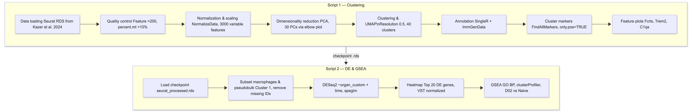
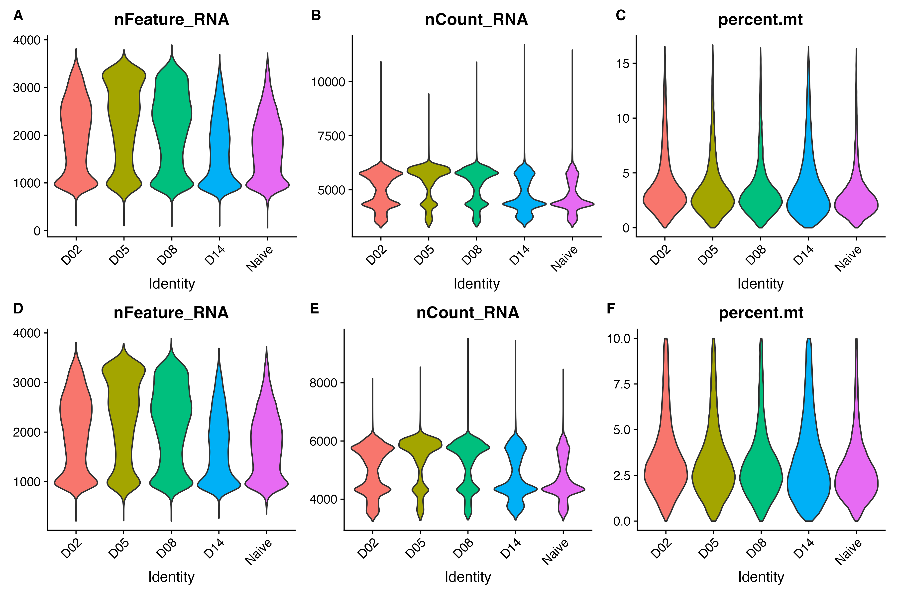
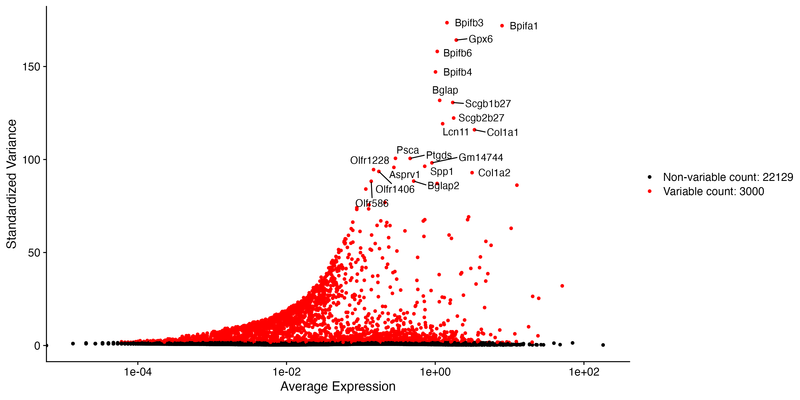

# mouse-nasal-mucosa-scrna
Analysis of mouse nasal mucosa after influenza infection with single cell RNA-seq

## Methods
### Computational Resources 
All analyses were conducted on a local Apple MacBook Pro (M4 architecture). RStudio v 2025.05.1+513 (REFERENCE) was the primary IDE used for the project. The workflow for the analysis is pictured in Figure 1. 

**Figure 1. Workflow used for scRNA-seq analysis.** All steps including data cleaning, normalization and scaling, dimensionality reduction, clustering, annotation, differential analysis, gene set enrichment analysis, and figure creation are depicted.

### Data Acquisition
The scRNA data was acquired from Kazer and colleagues’ study of tissues in the nasal mucosa of mice (*Mus musculus*) after infection with influenza A virus, IAV (REFERENCE HERE). The experimental design consisted of three mice per timepoint, sacrificed at five timepoints after introducing IAV: naive (uninfected), and 2, 5, 8, and 14 days post-infection (dpi). At each timepoint, three distinct regions of the nasal mucosa were dissected and sequenced: respiratory mucosa (RM), olfactory mucosa (OM), and lateral nasal gland (LNG). The data was obtained in the form of an RDS file containing a Seurat object with 156,572 cells prior to any filtering.

### Quality Control 
To identify and remove potentially degraded cells, empty droplets, and doublets, mitochondrial reads and unique RNA features were assessed with `PercentageFeatureSet` and subsequently filtered with`subset` from Seurat v5.4.0 (REFERENCE SEURAT). Filtering was applied based on violin plot outputs, where cells were removed if they contained less than 200 `nFeature_RNA` and more than 10% `percent.mt`. No upper limit was applied to the nFeature_RNA as the distribution showed no prominent outlier population that would have suggested doublets (Figure 2). Approximately 56,000 missing mouse_id values were identified and retained for clustering analysis, but excluded from statistical analysis.

**Figure 2. Distribution of quality metrics before and after filtering.** Violin plots showing the distribution of (A, D) unique RNA features per cell, (B, E) total RNA counts per cell, and (C, F) mitochondrial read percentage across all five timepoints before (A–C) and after (D–F) filtering. Cells with fewer than 200 unique RNA features or greater than 10% mitochondrial reads were excluded, retaining 149,125 of 156,572 cells for downstream analysis.

### Normalization, Scaling and Dimensionality Reduction
Data normalization was performed with the `NormalizeData` function from Seurat, and variable features were identified with `FindVariableFeatures`. 3000 features were selected for further analysis as the variable feature plot identified variation in the dataset was captured by this subset (Figure 3). `ScaleData` was applied to the subset of variable features rather than all genes due to memory constraints with a dataset containing approximately 156 000 cells. Principal components analysis (PCA) was run with `RunPCA`, where the top 30 PCs were selected for downstream clustering analysis to balance the variation in the dataset without retaining too many dimensions. A visual assessment of an elbow plot determined that 30 PCs confirmed that most variation would be retained (Figure 4). 

**Figure 3. Variable features capture biologically meaningful variation in the data across all cell types.** Variable feature plot showing the standardized variance against average expression for all 25,129 genes. Red dots indicate the 3000 variables selected by `FindVariableFeatures` with the top 20 features labelled.

**Figure 4. Variance captured by principal components shows gradual decrease.** Elbow plot showing the standard deviation associated with each of the top 50 principal components (PCs) from PCA. Thirty PCs were selected for downstream clustering to capture sufficient variance without retaining noise. 

### Clustering
Graph-based clustering was performed with `FindNeighbours` and `FindClusters`. The analysis was run with 30 PCs and 0.5 resolution to balance cluster specificity with interpretability, consistent with the resolution of 0.6 used in Kazer and colleagues work (REFERENCE HERE). `FindAllMarkers` was used to identify differentially expressed genes for each of the identified clusters.

### Annotation
Automatic annotation was performed with SingleR v2.10.0 (REFERENCE HERE) using the celldex v1.18.0 `ImmuneGenData` library containing mouse bulk expression data from the Immunologic Genome Project (REFERENCE HERE). The `ImmunGenData` reference was selected over the `MouseRNASeqData` reference for a more detailed annotation for immune-specific cell types and subtypes.

### Differential Expression Analysis and Visualization
Prior to differential analysis, the data were subset to cluster 1, which was identified as a predominantly macrophage population based on SingleR annotation and further validated through `FindAllMarkers`. To reduce false positives from arising as a result of the pseudoreplication that is characteristic of single-cell data, mean expression for each gene was aggregated across all cells within each mouse per timepoint and tissue type using pseudobulk analysis. Cells with missing mouse IDs were filtered out, then Seurat’s `AggregateExpression` function was used for pseudobulking, treating each mouse as an independent observation. Raw counts from the RNA assay layer of the Seurat object were extracted and used for DESeq2 (VERSION) analysis of differentially expressed genes, including tissue types and timepoints in the statistical model (REFERENCE DESEQ2 HERE). Finally, `lfcShrink` from DESeq2 was used to calculate log2 fold changes using the `apeglm` shrinkage method (VERSION, APEGLM REFERENCE). 

To visualize the top differentially expressed genes, a variance stabilizing transformation (VST) was performed prior to plotting results with pheatmap (VERSION, PHEATMAP REFERENCE). 

### Gene Set Enrichment Analysis
GSEA was conducted to identify enriched biological processes in macrophages at peak viral load (D02) relative to naive mice using the `gseGO` function from the clusterProfiler  package (VERSION, CLUSTERPROFILER REFERENCE). Gene sets were taken from the Gene Ontology Biological Processes (GO BP) ontology through the Bioconductor org.Mm.eg.db mouse annotation database (VERSION, REFERENCE).